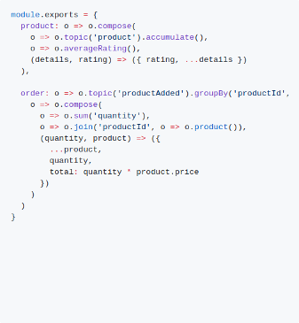
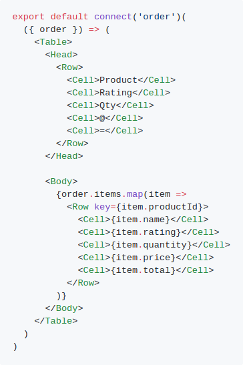
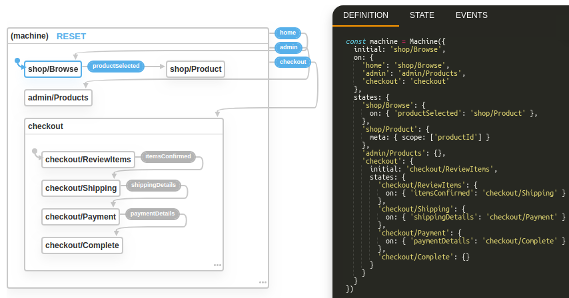

# xest

Modern Reactive Programming

## What is it?

On the surface, `xest` is an event sourcing database with bindings for popular UI frameworks. It stores and indexes
published messages and allows efficient querying of those messages using a query language heavily inspired by 
[`ReactiveX`](http://reactivex.io/). Its UI bindings allow simple, component level access to the event store and
intuitive "scoping" of queries. It even comes with a query analyzer!

Digging a little deeper, `xest` represents a fundamental shift in the way we model data in our applications. By 
swapping the fundamental unit of data from SQL tables or NoSQL documents to messages or events, a number of 
benefits become apparent.

- Queries are inherently real-time. All of them, all the time.
- Vastly less complexity and code. No boilerplate. Persistence just happens.
- Workflows and processes can be modelled visually.
- Everything starts to become "declarative".
- The entire history of every action taken in the system is available for analysis.

`xest` enables all this by providing: 

- a lightweight "run anywhere" host and low configuration consumer,
- a simple core expression language focused on extensibility and reuse,
- higher order components and hooks for [`React`](https://reactjs.org/) (more frameworks coming),
- workflows and processes built on the [`xstate`](https://xstate.js.org/) library (coming soon!),
- out of the box authentication providers.

## A Glimpse...

 

*Simple but powerful query language heavily inspired by Rx, and simple React bindings that keep your UI up to date*

*Model workflows visually using `xstate` tools*

## Documentation

For newcomers, both reactive programming noobs and Rx afficionados, we recommend running through the
[getting started guide](https://danderson00.github.io/xest/#/guides/getting-started/1-introduction.md) (video tutorial 
coming soon!)

To get up and running quickly, follow the instructions in the 
[bundle documentation](https://danderson00.github.io/xest/#/xest.bundle/).

API documentation is available on the [documentation site](https://danderson00.github.io/xest/).

## Packages

|||||
|---|---|---|---|
|@xest/bundle|Host process and socket framework bundle|||
|@xest/core|Core expression language and serialization mechanisms|||
|@xest/devtools|Development tools (query runner)|||
|@xest/fsm|State machine tools|||
|@xest/host|"Run anywhere" host process|||
|@xest/react|Higher order components and hooks for `React`|||
|@x/socket|Reliable observable socket framework|||
|@x/socket.auth|Authentication middleware for `@x/socket`|||
|@x/socket.xest|`@xest/host` optimizations as middleware for `@x/socket`|||
