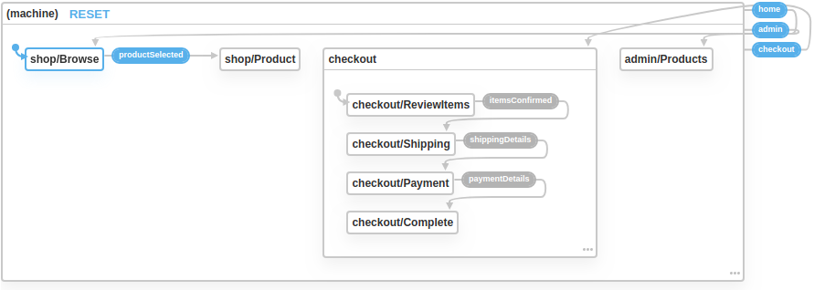

# Modelling With Expressions - Part 1 -  Introduction

In this guide, we're going to take you through three of the key expression operators that you'll need when you model
your event domain with xest by building a simple online shop. We'll also show you how to dynamically evaluate 
expressions for simple filtering scenarios.

## Getting Set Up

The code we will use throughout the guide is available [on github](https://gitlab.com/danderson00/xest.sample.shop),
and we recommend you clone the code and start the app with the following commands:

```shell
git clone https://gitlab.com/danderson00/xest.sample.shop.git
cd xest.sample.shop
yarn
yarn start
```

The `yarn start` command starts both the xest host and the react application.

## Overview

The application is bootstrapped with `create-react-app` and is structured accordingly. Inside the `src` directory,
you'll find a root index component that configures xest, the 
[navigation state machine](/guides/getting-started/4-navigation.md) for the application, the 
[vocabulary definition](/guides/getting-started/5-vocabulary.md) and a `components` directory. The `components` 
directory is arranged by feature with the application shell in the root.

We're going to look at three operators - `groupBy`, `compose` and `join`. We'll point out how each operator is used in 
the vocabulary and how the resulting model is consumed by components.

## Navigation

The [xstate visualizer](https://xstate.js.org/viz/) produces the following diagram for our navigation state machine:



## Let's Get Started!

Head over to the [next part](2-compose.md) of the guide to learn how to combine expressions using the `compose` 
operator.
 