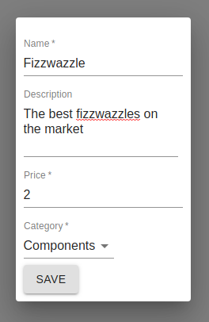
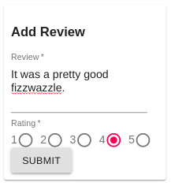
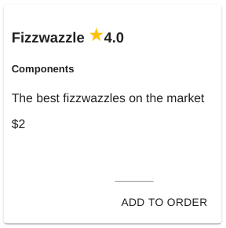

# Modelling With Expressions - Part 2 - Composition

In this first part of the guide, we are going to explore the `compose` operator. It allows us to write multiple 
expressions over the same stream and then combine the results of those expressions into a single result observable.

## Syntax

Let's take a look at the `compose` operator's signature:

```javascript
compose(...expressions, aggregator)
```

A variable number of expressions can be passed to the operator, and the last parameter is always a function that
transforms the results of each expression into a single result. As a simple example, if we wanted to calculate the
average of a stream of numbers, we could use `compose` like follows:

```javascript
o => o.compose(
  o => o.sum(),
  o => o.count(),
  (sum, count) => sum / count
)
```

Let's take a look at an example from our online shop vocabulary.

## What's in a Product

In the model for a product in our shop, we are using `compose` to merge an average rating into an object containing
the rest of the product details.

Let's take a look at the relevant lines from `vocabulary.js`:

```javascript
product: o => o.compose(
  o => o.topic('product').accumulate(),
  o => o.averageRating(),
  (details, rating) => ({ rating, ...details })
),
averageRating: o => o.topic('review').average('rating'),
```

In the first expression, we are using the `accumulate` operator to create an object from messages with a topic of 
`product`. The second uses the `averageRating` vocabulary to calculate the average rating from review messages.

The third parameter to the `compose` operator is a simple function that adds the `rating` property to our product
details object.

## New Product on the Shelves

Looking at our `admin/ProductDetails` and `review/AddReview` components, it's pretty easy to infer the shape of the
`product` and `review` messages:




This results in a simple structure that we can bind to in our UI:

```JSON
{
  "name": "Fizzwazzle",
  "description": "The best fizzwazzles on the market",
  "price": 2,
  "category": "Components",
  "rating": 4
}
```


## Alternate `compose` Syntax

The `compose` operator also has an alternate syntax that accepts a single parameter, an object hash where each
property of the object is a stream expression. The expressions are evaluated and the result merged into a new object
of the same shape. Our product expression may have looked like:

```javascript
product: o => o.compose({
  details: o => o.topic('product').accumulate(),
  rating: o => o.averageRating()
})
```

This would result in a slightly different result with the product details being exposed on a `details` property.

## Next Up - Grouping

Head over to the [next part](3-groupBy.md) of the guide to learn how to create lists using the `groupBy` operator.
