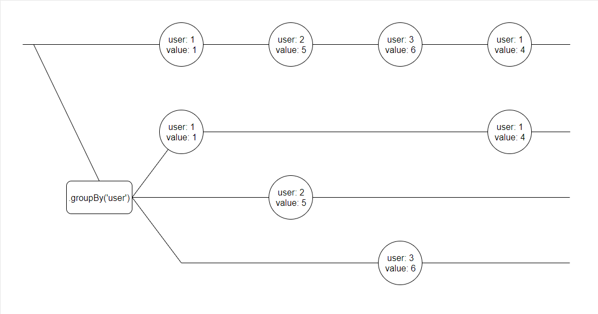

# Modelling With Expressions - Part 3 - Splitting Streams Into Groups

An essential part of any query language is the ability to split data into groups of related items based on a key.

When grouping streams, the operation can be visually expressed like the following:


*Each message that passes through the grouping operator is forwarded to the appropriate child stream based on a key*

Using the specified property name or expression to determine a key, the `groupBy` operator splits a stream of messages 
into a set of child observables that are only forwarded matching messages. 

xest allows us to apply an expression to each group observable. For example, if we wanted to calculate the
average value published for each user, we could use something like `o => o.groupBy('user', o => o.average('value'))`.

The `groupBy` operator also allows us to specify an expression that removes the group when truthy.

Let's take a look at how it is used in our online shop.

## Product Lists

Our `admin/Products` page displays a list of products added to our shop. It uses a simple piece if vocabulary named
`products`:

```javascript
products: o => o.groupBy('productId', o => o.product(), o => o.topic('productDeleted'))
```

Remembering from the [last part](2-compose.md) of the guide that our `product` vocabulary constructs an object with 
product details and a rating, we can see that the result will be an array of product details for each unique product ID
that has entries removed when a corresponding `productDeleted` message is received.

We can consume this simply in a component:

```jsx
{products.map(product =>
  <ProductCard
    key={product.productId}
    product={product}
    onClick={() => setSelectedProduct(product)}
  />
)}
```


## Aggregate Types

It's important to note that the `groupBy` operator returns a different type of observable to operators we've seen so 
far, and has a different set of operators that you can use. For example, calling `count` on an aggregate observable
will return the number of elements in the aggregate, rather than the number of messages received. Aggregate observables
also expose the `orderBy` and `orderByDescending` operators for ordering results.

<p class="yellowTip">
  You can see the complete list of aggregate operators <a href="#/xest.core/docs/aggregate.md">here</a>.
</p> 

## Next Up - Accessing Other Scopes  

In the [next part](4-join.md) of the guide, we'll look at using the `join` operator to access messages outside the
current scope.
