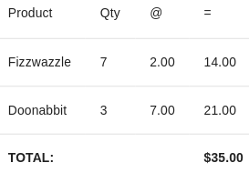

# Modelling With Expressions - Part 4 - Joining Across Scopes

Most of the time when our expressions are evaluated, they will be confined to a particular scope. In many cases, we
need to access messages outside the current scope for accessing information about a related entity. The `join`
operator allows us to use information from messages in the current scope to construct a new scope and evaluate an
expression within that scope.

To illustrate the concept and introduce the `join` operator, let's look at the checkout page of our shop

## Checking Out

Adding products to a shopping cart is done by publishing a `productAdded` message. The `shop/AddToOrder` component is a 
small component that is embedded in the `Product` and `ProductCard` components that publishes this message.

The guts of our `order` vocabulary looks like:

```javascript
o => o.topic('productAdded').groupBy('productId',
  o => o.compose(
    o => o.select('productId'),
    o => o.sum('quantity'),
    o => o.join('productId', o => o.product()),
    (productId, quantity, product) =>
      ({ productId, quantity, total: quantity * product.price, ...product })
  )
)
```

The first line of the expression filters messages to `productAdded` messages and then groups those by `productId`. This
presents a problem - if messages have been filtered and grouped, how can we obtain details of the product? Messages 
with a topic of `product` will have been filtered out. 

## Joining Across Scopes
 
The `join` operator allows us to reset any current scope or filters and construct a new scope based on specific 
properties from messages in the original scope. 

In the third expression passed to the `compose` operator, the `join` operator plucks the `productId` property from the 
current observable, constructs a new scope from the value and applies our `product` vocabulary to it. In the aggregator
expression, you can see the product price being used to calculate the total cost, and the product details being
spread on to the resulting object.



## Next up - Evaluating Expressions Dynamically

In the [next part](5-evaluate.md) of the guide, we show you how to evaluate parameterised expressions dynamically using 
the `evaluate` higher order component. 