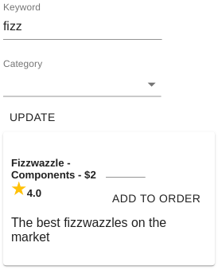

# Modelling With Expressions - Part 5 - Dynamically Evaluating Expressions

A key part of any application is to update the user interface based on user input. `xest` provides hooks and higher 
order components for this purpose. The provided hook, `useEvaluate` provides a better experience with less boilerplate 
code and is such the option we will cover in this guide.

## The `useEvaluate` Hook

Looking at the `Browse` component, we can see the use of the `useEvaluate` hook:

```jsx
import React from 'react'
import { useEvaluate } from '@xest/react'
import { Form, Text, Select, Submit } from '@cordelta/react-forms-material'
import ProductCard from './ProductCard'

export default () => {
  const [products, search] = useEvaluate('search', {}, [])

  return (
    <div>
      <Form onSubmit={search} display="inline">
        <Text name="keyword" label="Keyword" value="" />
        <Select name="category" label="Category" values={['', 'Components', 'Widgets']} />
        <Submit>Update</Submit>
      </Form>

      {products.map(product => (
        <ProductCard key={product.productId} product={product}/>
      ))}
    </div>
  )
}
```

The first parameter tells xest to use the `search` vocabulary. The second parameter is optional and should contain the 
scope to use when evaluating the vocabulary. The third is an optional array of parameters to pass to the vocabulary for 
an initial evaluation. If this parameter is not provided, the vocabulary will not be evaluated until the requested.

The return value of `useEvaluate` is an array containing the results of the evaluation and a function to request an
evaluation of the vocabulary. Any parameters passed to the function are passed to the vocabulary. This function is 
executed when the `onSubmit` event of the form is triggered, causing the form contents to be passed as a parameter to 
the `search` function.

## The Vocabulary

Let's take a look at the `search` vocabulary:

```javascript
search: (o, { keyword, category } = {}) => o.products().where(x =>
  (
    !keyword || 
    x.name.includes(keyword) || 
    (x.description && x.description.includes(keyword))
  ) &&
  (!category || x.category === category)
)
```

Here, as well as our usual `o` parameter, we accept a parameter that is an object containing `keyword` and `category`
properties from our form. The expression uses the `products` vocabulary to construct a list of products and filters
those based on the inputs.



It's important to note that any expression that is evaluated dynamically in this way is considered "transient" and has 
fewer optimisations applied. Dynamic evaluation should not be considered a replacement for the `connect` HoC. 

<p class="yellowTip">
  You can also pass an arbitrary expression to the <code>useEvaluate</code> hook. When doing this, instead of passing 
  an array of parameters to the evaluate function, pass an object containing closures for the expression. See the
  <a href="#/xest.react/docs/hocs.md?id=evaluate">API reference</a> for more information.
</p>

## That's it!

For more information on the various operators and other parts of xest, please check out our reference materials:

- [Stream operator reference](/xest.core/docs/stream.md)
- [Aggregate operator reference](/xest.core/docs/aggregate.md)
- [React HoC reference](/xest.react/docs/hocs.md)
- [React hooks reference](/xest.react/docs/hooks.md)
- [Bundle documentation and CLI reference](/xest.bundle/)
 