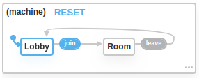

# Getting Started With `xest` - Part 4 - Navigation

This part shows you how to use state machines constructed from published messages to create a navigation graph for our
application.

## Setup

If you created your own application from previous parts of the guide, or to run the sample for the first time, we 
recommend that you download the source for this part from github:

```shell
git clone https://gitlab.com/danderson00/xest.sample.chat.git
cd xest.sample.chat
git checkout navigation
yarn
``` 

## Components

There are only a few changes to our components. Firstly, you'll notice they've moved to a `components` directory to
keep things organised. 

You'll recognise the `Lobby` component as our old `App` component that captured the user's name and the room name, but 
instead of rendering a `Room` component directly, we're publishing a message with the form values and a topic of `join`
when the button is clicked.

```jsx
<Form display="inline" resetOnSubmit onSubmit={({ username, room }) =>
  publish({ topic: 'join', room, username: username || 'Anonymous' })}
>
  <Text name="username" label="User Name" />
  <Text name="room" label="Room" required />
  <Submit>Join</Submit>
</Form>
```

The only other change was to the `Send` component - we added a button that publishes a message with a topic of 
`leave` when clicked:

```jsx
<Button onClick={() => publish({ topic: 'leave', username })}>
  Leave Room
</Button>
```

## Navigation Graphs

Let's take a look at the `navigation.js` file:

```javascript
import { Machine } from '@xest/react'

const machine = Machine({
  initial: 'Lobby',
  states: {
    'Lobby': {
      on: { 'join': 'Room' },
    },
    'Room': {
      meta: { 
        scope: ['room'],
        props: ['username']
      },
      on: { 'leave': 'Lobby' }
    }
  }
})

export default machine
```

If you're familiar with state machines, you'll recognise this as a simple state machine with two states, `Lobby` and
`Room`. Toggling between the two states happens when `join` and `leave` events occur. We'll talk about the `meta`
property in a second.

If we head on over to the [`xstate` visualizer](https://xstate.js.org/viz/) and copy just the machine definition into
the relevant area, we get something like:



## Wiring It Up - The `Navigator` Component

The last change to our application is in `index.js`. Instead of rendering an `App` component, we're now rendering
a `Navigator` component and passing it our state machine:

```jsx
ReactDOM.render(
  <Provider host={host}>
    <Navigator
      machine={navigation}
      resolveComponent={path => import(`./components/${path}`).then(m => m.default)}
    />
  </Provider>,
  document.getElementById('root')
)
```

The `resolveComponent` function is passed the name of the state we are currently in (i.e. `Lobby` or `Room`) and must
return the associated component, either directly or asynchronously using a `Promise`.  

## Scope

As you probably noticed in our state machine definition, the `Room` state contains two pieces of metadata. 

The first, `scope` instructs xest to scope the component using the specified property from the message that triggered
the state change. In our case, if a message with the `room` property set to `General` is published, the `Room` 
component has a scope of `{ room: 'General' }`. As before, the scope values are spread on to the component props.

The second piece of metadata, `props` instructs xest to pluck the specified properties from the triggering message and
expose them as props on the component. Our `Room` component ends up with two props being passed `room` and `username`.

## Next - Reusing Expressions With Vocabulary

In the [next part](5-vocabulary.md) of this guide, we look at reusing expressions and securing our applications with
vocabulary.
